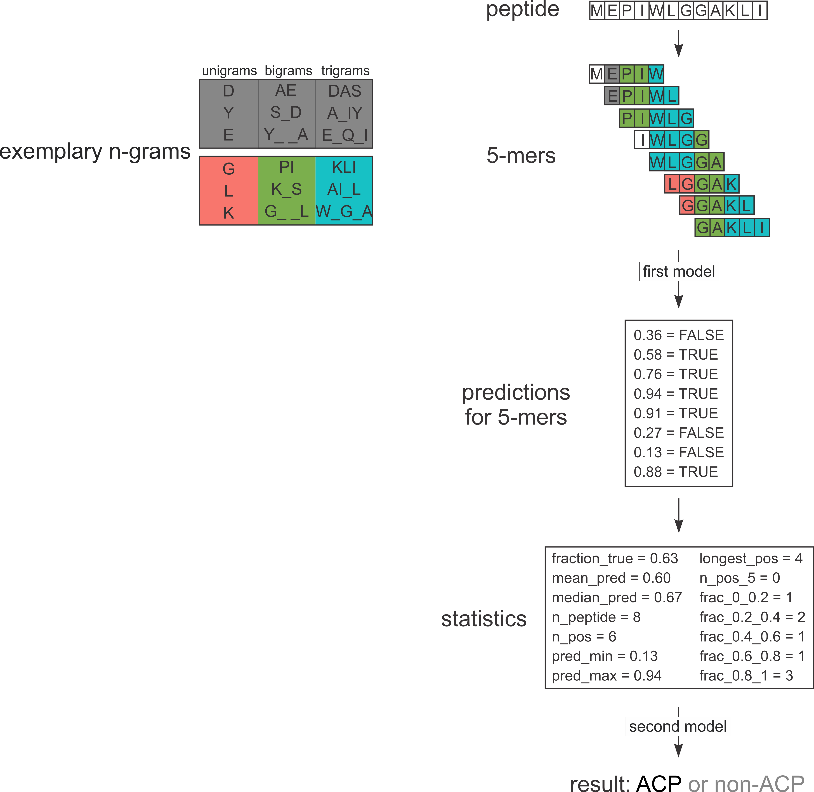
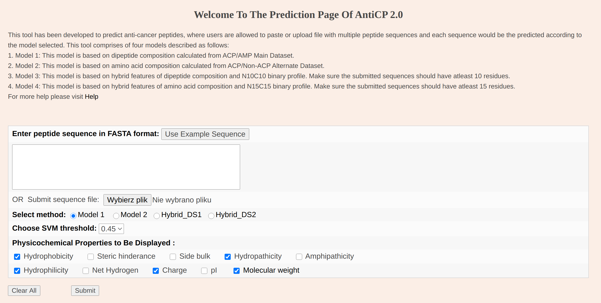

```{r setup, include=FALSE}
knitr::opts_chunk$set(echo = FALSE)
library(knitr)
library(drake)
library(seqinr)
library(dplyr)
library(ggplot2)
library(biogram)
library(tidyr)
acp <- readd(acp)
amp <- readd(amp)
neg <- readd(neg)
benchmark_res <- read.csv("./data/benchmark_res.csv")

datasets <- list("ACP" = acp, "AMP" = amp, "neg" = neg)
dataset_color = c(ACP = "#d73027", AMP = "#fc8d59", neg = "#91bfdb")
```

## CancerGram structure



## Three classes of peptides: ACP/AMP/negative

- ACP: anticancer peptides
- AMP: antimicrobial peptides (presumably non-anticancer)
- negative (neg): peptides which are non-ACP and non-AMP

```{r,results='asis'}
data.frame(dataset = names(datasets), 
           n = unname(lengths(datasets)),
           avg_length = unname(sapply(lapply(datasets, lengths), mean))) %>% 
  kable
```


## Three classes of peptides: ACP/AMP/negative

```{r}
aac <- lapply(1:length(datasets), function(i) {
  data.frame(table(unlist(datasets[[i]]))) %>% 
    setNames(c("aa", "freq")) %>% 
    mutate(freq = freq/sum(freq),
           dataset = factor(names(datasets[i]), levels = c("ACP", "AMP", "neg")))
}) %>% bind_rows()

ggplot(aac, aes(x = aa, y = freq, fill = dataset)) +
  geom_col(position = "dodge") +
  scale_x_discrete("Amino acid") +
  scale_y_continuous("Frequency") +
  scale_fill_manual("Dataset", values = dataset_color) +
  theme_bw() +
  theme(legend.position = "bottom")


```


## ACPs and AMPs have similar properties

```{r}

prop_df <- data.frame(nice_name = c("Hydrophobicity (Black)",
                                    "Positive residues",
                                    "Helix equlibrium",
                                    "Charge",
                                    "Helix propensity",
                                    "Hydrophobicity (Kyte-Doolitle)"),
                      row.names = c("BLAS910101", "FAUJ880111", 
                                    "FINA770101", "KLEP840101", 
                                    "KOEP990101", "KYTJ820101")
)


encode_seq <- function(x, property) {
  sapply(x, function(ith_seq) {
    mean(aaprop[property, tolower(ith_seq)])
  })
}

prop_dat <- lapply(rownames(prop_df), function(ith_prop_type) 
  lapply(names(datasets), function(ith_seq_type) {
    data.frame(seq_type = ith_seq_type, prop_type = ith_prop_type, 
               value = encode_seq(datasets[[ith_seq_type]], ith_prop_type),
               stringsAsFactors = FALSE)
  }) %>% bind_rows
) %>% bind_rows() %>% 
  mutate(prop_type = factor(prop_type),
         prop_type = factor(prop_type, 
                            labels = prop_df[levels(prop_type), "nice_name"]))

ggplot(prop_dat, aes(x = seq_type, y = value, color = seq_type)) +
  geom_boxplot() +
  scale_color_manual("Dataset", values = dataset_color) +
  scale_x_discrete("Dataset") +
  scale_y_continuous("Value") +
  facet_wrap(~prop_type, scales = "free_y") +
  theme_bw()
```

## Physicochemical properties

```{r}
prop_df <- data.frame(nice_name = c("Charge",
                                    "Positive residues",
                                    "Helix equlibrium",
                                    "Helix propensity",
                                    "Hydrophobicity (Black)",
                                    "Hydrophobicity (Kyte-Doolitle)"),
                      row.names = c("KLEP840101", "FAUJ880111", 
                                    "FINA770101", "KOEP990101", 
                                    "BLAS910101", "KYTJ820101")
)

encode_seq <- function(x, property) {
  sapply(x, function(ith_seq) {
    mean(aaprop[property, tolower(ith_seq)])
  })
}

prop_dat <- lapply(rownames(prop_df), function(ith_prop_type) 
  lapply(names(datasets), function(ith_seq_type) {
    data.frame(seq_type = ith_seq_type, prop_type = ith_prop_type, 
               value = encode_seq(datasets[[ith_seq_type]], ith_prop_type),
               stringsAsFactors = FALSE)
  }) %>% bind_rows
) %>% bind_rows() %>% 
  mutate(prop_type = factor(prop_type, levels = rownames(prop_df)),
         prop_type = factor(prop_type, 
                            labels = prop_df[levels(prop_type), "nice_name"]))


data(aaindex)
id_vec <- sapply(aaindex, function(i) i[["H"]])


data.frame(row.names = rownames(prop_df), 
           property = sapply(rownames(prop_df), function(i) aaindex[[which(id_vec == i)]][["D"]])) %>% 
  kable

```

## Physicochemical properties - charge

```{r}
do_prop_plot <- function(x) 
  ggplot(x, aes(x = seq_type, y = value, color = seq_type)) +
  geom_boxplot() +
  scale_color_manual("Dataset", values = dataset_color) +
  scale_x_discrete("Dataset") +
  scale_y_continuous("Value") +
  facet_wrap(~prop_type, scales = "free_y", ncol = 2) +
  theme_bw()

filter(prop_dat, prop_type %in% c("Charge", "Positive residues")) %>%
  do_prop_plot
```

## Physicochemical properties - hydrophobicity

```{r}
filter(prop_dat, prop_type %in% c("Hydrophobicity (Black)", "Hydrophobicity (Kyte-Doolitle)")) %>%
  do_prop_plot
```

## Physicochemical properties - helix propensity

```{r}
filter(prop_dat, prop_type %in% c("Helix equlibrium", "Helix propensity")) %>%
  do_prop_plot
```

## Physicochemical properties - overall

```{r}
ggplot(prop_dat, aes(x = seq_type, y = value, color = seq_type)) +
  geom_boxplot() +
  scale_color_manual("Dataset", values = dataset_color) +
  scale_x_discrete("Dataset") +
  scale_y_continuous("Value") +
  facet_wrap(~prop_type, scales = "free_y", ncol = 2) +
  theme_bw()
```

## ACPs and AMPs have similar properties

```{r}
filter(prop_dat, 
       prop_type %in% c("Charge", "Hydrophobicity (Kyte-Doolitle)")) %>% 
  group_by(prop_type) %>% 
  mutate(row = row_number()) %>% 
  pivot_wider(names_from = prop_type, values_from = value) %>% 
  ggplot(aes(x = Charge, y = `Hydrophobicity (Kyte-Doolitle)`, color = seq_type, fill = seq_type)) +
  #  geom_density2d(aes(alpha = ..level..))
  stat_density_2d(aes(alpha = ..level..), geom = "polygon", color = "black", size = 0.4) +
  scale_fill_manual("Dataset", values = dataset_color) +
  facet_wrap(~seq_type) +
  theme_bw() +
  theme(legend.position = "bottom")

```

## Existing software: AntiCP 2.0 - two separate models

AntiCP 2.0 has two models: 

1. discrimination between ACP and AMP
2. discrimination between ACP and neg (non-AMP/non-ACP)




## Existing software: AntiCP 2.0 - two separate models

```{r}
benchmark_res %>% 
  group_by(Datasets) %>% 
  filter(!(grepl("CancerGram", Software)) & Datasets == "ACP/AMP") %>% 
  kable()
```

<br/>


```{r}
benchmark_res %>% 
  group_by(Datasets) %>% 
  filter(!(grepl("CancerGram", Software)) & Datasets == "ACP/neg") %>% 
  kable()
```


## CancerGramMC - multiclass model
```{r}
benchmark_res %>% 
  group_by(Datasets) %>% 
  filter(Datasets == "ACP/AMP" & !(Software %in% c("CancerGram", "CancerGramMC"))) %>% 
  kable()
```

<br/>

```{r}
benchmark_res %>% 
  group_by(Datasets) %>% 
  filter(Datasets == "ACP/neg" & !(Software %in% c("CancerGram", "CancerGramMC"))) %>% 
  kable()
```